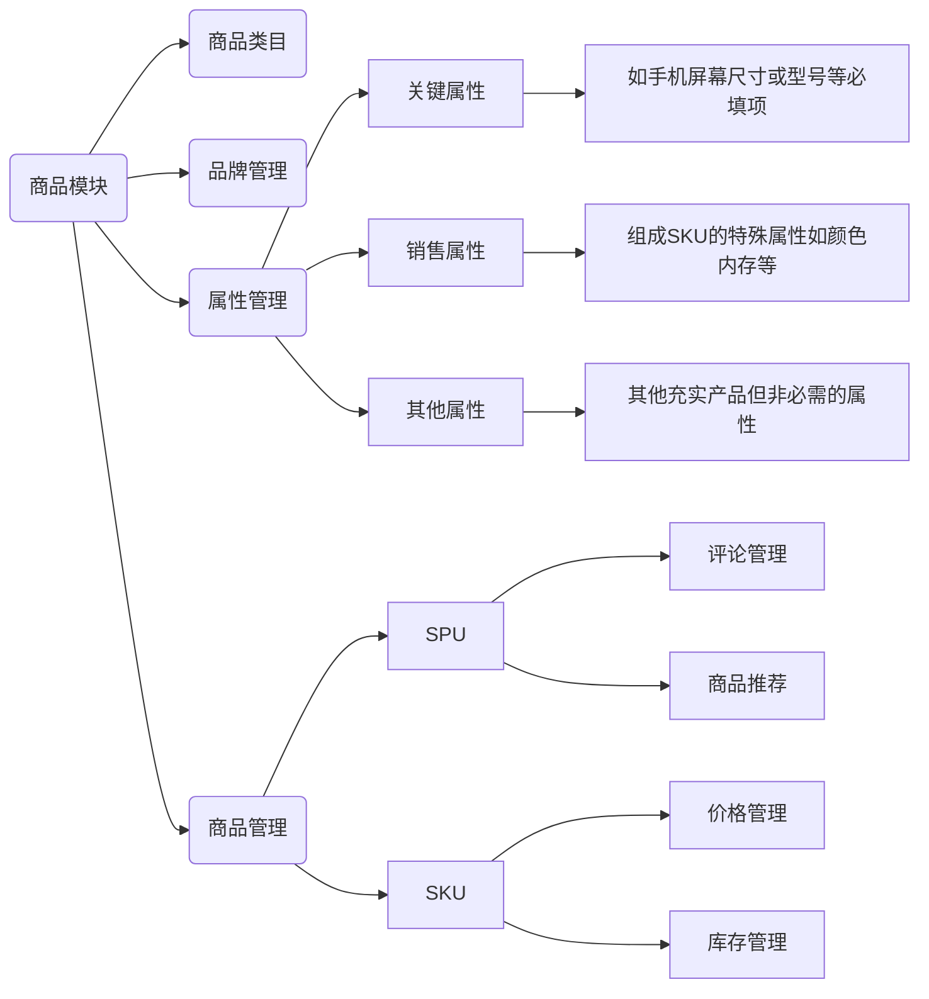
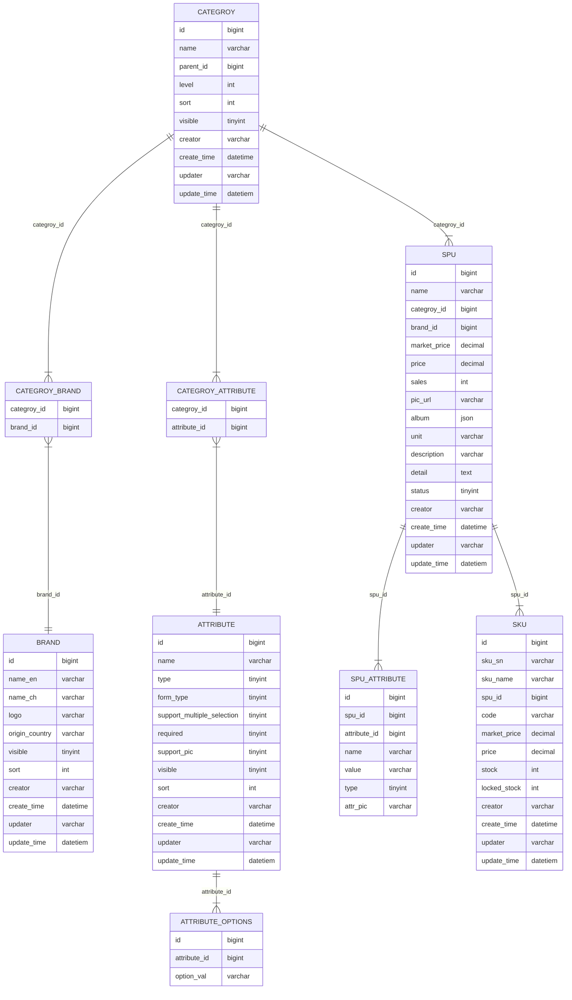

# 后台商品模块

# 商品模块总览

# 商品类目管理

商品类目分为后台类目和前台类目，前台类目服务于应用前台，直接服务于用户；后台类目服务于管理系统。

- 后台类目：
    1. 商品后台类目相对固定，确定后一般不轻易变更或删除，如果类目下挂载有商品时，不能删除或作废
    2. 后台类目定为3层，商品必须挂载到叶子类目下
    3. 品牌等挂载到1级类目下、商品属性挂载到任意层级类目
    4. 为赠品、促销品等商品设置专门的类目“其他”
- 前台类目
    1. 前台类目可以支持不同的客户端，如PC端、H5端、APP端等渠道有所差异
    2. 前台类目独立服务于前台，与后台类目没有直接关系
    3. 前台类目拆分策略：
        1. 与后台类目对应
        2. 直接与品牌或者商品对应
        3. 对应后台类目叶子节点和某项属性的组合

# 商品品牌管理

品牌关联到类目上，关系可以为一对一、一对多、多对一，例如雀巢的产品有咖啡、奶粉、饮料等不同种类，这三类产品属于不同的叶子类目

- 品牌相关字段：
    - Logo
    - 中文名
    - 英文名
    - 产地
    - 备注
    - 状态

# 商品属性管理

## 一、商品属性分类

- 关键属性
    - 能够确认唯一“产品”的属性，如手机的品牌和型号（确定SPU？），主要用于前台商品的搜索
- 销售属性（产品规格SKU属性）
    - 确定商品SKU的属性，如颜色、尺码等，主要服务于前台商品销售时产品规格的选择
- 其他属性
    - 用于丰富商品内容的属性

## 二、属性继承

商品属性绑定在商品类目下，每一层级的商品属性继承上一层级的商品属性。

## 三、商品属性字段

- 属性名称
- 属性类型（关键属性、销售属性、其他属性）
- 表单类型（单选、多选、文本框）
- 是否必填
- 是否支持配置图片（销售属性）
- 启用状态
- 所属类目
- 排序
- 可选值列表（表单类型为选择类型时使用）（TODO：是否单拉表）

# 商品管理

## SPU

商品SPU存储商品公共属性

## SKU

商品SKU表存储商品库存、价格、SKU属性（销售属性）

# 商品模块数据表设计

